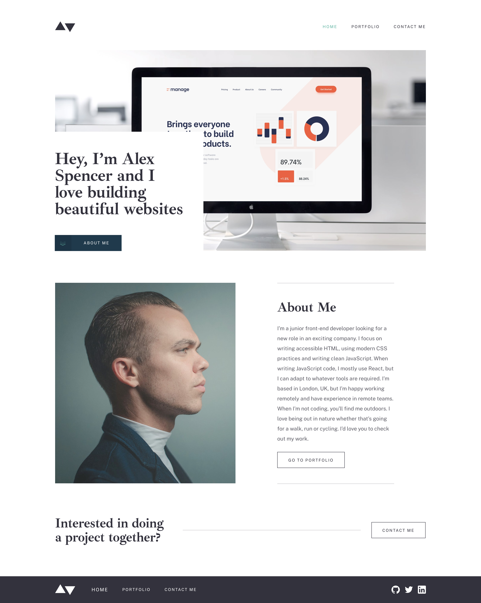

# Minimalist_Portfolio

Premium [FrontEnd Mentor](https://www.frontendmentor.io/challenges) Challenge

# Welcome ! 👋

## Screenshot

### Links

- Live Site URL: [Minimalist_Portfolio](https://alexandre-st-mini-portfolio.netlify.app)

## Available scripts

In the project director, you can run :

### `npm install`

### `yarn start`

## My process

### Built width :

- [ReactJs](https://reactjs.org)
- [SASS](https://sass-lang.com)
- [Formik](https://formik.org) : For keeping track of values / errors / visited fields.

## Author

- Frontend Mentor - [@Alexandre-st](https://www.frontendmentor.io/profile/Alexandre-st)
- Twitter - [@a_saintprix](https://twitter.com/a_saintprix)
